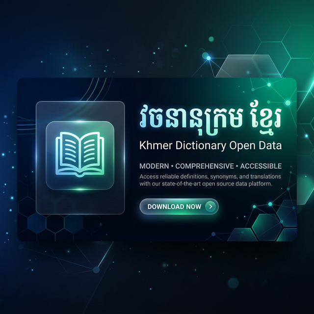

# 🇰🇭 Khmer Dictionary Open Data

A premium, high-performance dictionary dataset designed for seamless integration into Flutter applications.

## 📊 Dataset Overview

| Dictionary Type | Description | Word Count |
| :--- | :--- | :--- |
| **English ➔ Khmer** (`en_kh`) | Comprehensive English to Khmer translations. | 21,043 |
| **Khmer ➔ English** (`kh_en`) | Extensive Khmer to English translations. | 6,485 |
| **Khmer ➔ Khmer** (`kh_kh`) | Native Khmer definitions and meanings. | 4,686 |

---

## 🗄 Database Schema

The database `dictionary.db` uses a relational structure for efficiency and easy querying.

### 1. `words` Table
Contains the main word entries and metadata.
- `id`: Unique identifier (Primary Key).
- `word`: The search term (Khmer or English).
- `type`: Dictionary direction (`en_kh`, `kh_en`, `kh_kh`).
- `sound`: Path or reference to the audio file in `sounds/`.
- `isFavorite`: User flag for favorites.
- `isHistory`: User flag for search history.
- `created_at`: Timestamp of entry creation.

### 2. `definitions` Table
Detailed meanings and examples linked to `words`.
- `word_id`: Foreign key reference to `words.id`.
- `pos`: Part of Speech (e.g., noun, verb, adj).
- `definition_text`: The actual meaning/definition.
- `example`: Usage example sentence.
- `khmer_image_url`: Remote URL for related illustrations.
- `local_image_path`: Path to local image assets.

### 3. `synonyms` & `antonyms` Tables
Related words for the main entry.
- `word_id`: reference to `words.id`.
- `synonym` / `antonym`: The related word text.

### 4. `similar_words` Table
Alternative spellings or closely related terms.
- `word_id`: reference to `words.id`.
- `similar_word`: The similar word text.

---

## 🚀 Flutter Quick Start

### 1. Dependencies
Add to your `pubspec.yaml`:
```yaml
dependencies:
  sqflite: ^2.3.0
  path: ^1.8.3
```

### 2. Basic Query Example
```dart
Future<List<Map<String, dynamic>>> searchDictionary(String query, String type) async {
  final db = await openDatabase('dictionary.db');
  return await db.rawQuery('''
    SELECT w.word, d.definition_text, d.pos
    FROM words w
    LEFT JOIN definitions d ON w.id = d.word_id
    WHERE w.word LIKE ? AND w.type = ?
    LIMIT 10
  ''', ['%$query%', type]);
}
```

---
*Created with ❤️ for the Khmer Developer Community.*
